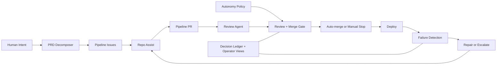

# prd-to-prod

> Turn product requirements into deployed software. Autonomously.

Drop a PRD. The pipeline decomposes it into issues, implements them as PRs,
reviews the code, merges on approval, and deploys. If CI breaks, it fixes itself.

## How it works



## Quick Start (Next.js + Vercel)

### Prerequisites

- GitHub account with Actions enabled
- [gh CLI](https://cli.github.com/) installed
- [gh-aw extension](https://github.com/github/gh-aw) installed: `gh extension install github/gh-aw`

### 1. Create your repo

Click **"Use this template"** → **"Create a new repository"**.

Clone your new repo locally.

> **Important: First-Time Setup** — Agentic workflows (the `.md` files in
> `.github/workflows/`) require compiled `.lock.yml` files to function as
> GitHub Actions. Running `setup.sh` (Step 2 below) handles this automatically
> by calling `scripts/bootstrap.sh`, which runs `gh aw compile`. If you push
> code before running setup, workflows will not trigger. To fix this after the
> fact, run `scripts/bootstrap.sh` or `gh aw compile` manually.

### 2. Run setup

```bash
./setup.sh
```

The wizard will:
- Ask for your app source directory (default: `src`)
- Configure `autonomy-policy.yml` with your paths
- Set up your PAT and Vercel deployment secrets
- Run bootstrap (labels, workflow compilation, repo settings)
- Configure the AI engine

For CI/automation:
```bash
./setup.sh --non-interactive --app-dir src
```

### 3. Configure branch protection

In **Settings → Rules → Rulesets**, create a rule for `main`:
- Require 1 approving review
- Require the `review` status check
- Allow squash merges only

### 4. Verify setup

```bash
./setup-verify.sh
```

### 5. Submit your first PRD

Create an issue with your product requirements, then comment `/decompose`.

Or drop a PRD file into `docs/prd/` and run:
```bash
gh aw run prd-decomposer
```

## Architecture

See [docs/ARCHITECTURE.md](docs/ARCHITECTURE.md) for the full system design.

See [docs/why-gh-aw.md](docs/why-gh-aw.md) for why this uses GitHub Agentic Workflows.

## Customization

### autonomy-policy.yml

Defines what the AI agents can and cannot do. The setup wizard configures
`allowed_targets` for your app directory. Edit this file to add or restrict
paths as your project grows.

## Self-Healing Loop

When CI fails on `main`, the pipeline:
1. Creates a `[Pipeline] CI Build Failure` issue
2. `auto-dispatch` triggers `repo-assist`
3. The agent reads failure logs, implements a fix, opens a PR
4. The review agent approves, auto-merge lands the fix
5. Deploy runs on the green main branch

This loop is autonomous — zero human intervention required.

## Authentication

The pipeline needs elevated permissions for auto-merge and workflow dispatch.
The setup wizard offers both options.

### Option 1: GitHub App (Recommended)

Auto-rotating tokens scoped per job. No manual rotation needed.

| Config | Type | Purpose |
|--------|------|---------|
| `PIPELINE_APP_ID` | Variable | App ID from the App settings page |
| `PIPELINE_APP_PRIVATE_KEY` | Secret | PEM private key generated in App settings |

### Option 2: Personal Access Token

Simpler setup. Create a [fine-grained PAT](https://github.com/settings/tokens?type=beta)
with Contents, Issues, Pull requests, Actions, and Workflows permissions.

| Config | Type | Purpose |
|--------|------|---------|
| `GH_AW_GITHUB_TOKEN` | Secret | PAT for auto-merge and workflow dispatch |

### Deployment Secrets

| Secret | Required | Purpose |
|--------|----------|---------|
| `VERCEL_TOKEN` | Yes | Vercel deployment token |
| `VERCEL_ORG_ID` | Yes | Vercel organization ID |
| `VERCEL_PROJECT_ID` | Yes | Vercel project ID |

## Variables Reference

| Variable | Required | Purpose |
|----------|----------|---------|
| `PIPELINE_HEALING_ENABLED` | No | Set to `false` to pause autonomous healing |

## Troubleshooting

### Workflows not triggering?

Agentic workflows need compiled `.lock.yml` files to function. Run
`scripts/bootstrap.sh` or `gh aw compile` to generate them.

### Deploy failing?

Verify your deployment secrets are configured in repo **Settings → Secrets and
variables → Actions**. For Vercel: `VERCEL_TOKEN`, `VERCEL_ORG_ID`,
`VERCEL_PROJECT_ID`.

### CI failing on empty repo?

The pipeline expects application code. Submit your first PRD to generate app
code via the `prd-decomposer` and `repo-assist` workflows, or add a minimal
app manually.

## License

MIT
