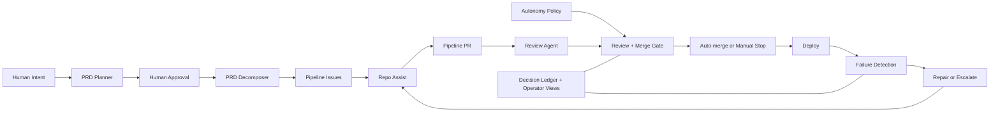

# Architecture

## System Thesis

This template provides a policy-bounded AI execution system for software delivery.
The repository contains multiple workflow YAML files, but the useful mental
model is not a flat count. It is a control plane plus a bounded execution lane.

- Humans own intent, policy, escalation rules, and authority expansion.
- gh-aw agents handle the work that requires judgment.
- Standard GitHub Actions remain the deterministic authority layer for routing,
  merge enforcement, deploy, and incident state transitions.

## High-Level Flow



## Human-Owned Control Plane

The AI lane is intentionally bounded. The following remain human-owned:

- product intent and acceptance criteria
- `autonomy-policy.yml`
- workflow files and agent instructions
- secrets, tokens, and kill switches
- deployment routing and target changes
- branch protection and merge-scope expansion
- sensitive-path approval when app changes cross policy boundaries

The system is designed to stop rather than silently widen its own authority.

## Planning Layer

An optional architecture planning step sits between PRD intake and decomposition:

```
PRD Issue → /plan → prd-planner → Architecture Comment + JSON Artifact
  → /approve-architecture → prd-decomposer (architecture-aware) → Issues
```

- **`prd-planner`** (gh-aw agent): Reads the PRD + deploy profile + existing codebase. Produces a human-readable architecture comment on the issue and a structured JSON artifact in repo-memory at `architecture/{issue-number}.json`.
- **`architecture-approve.yml`**: Listens for `/approve-architecture`, verifies write access, swaps `architecture-draft` → `architecture-approved`, dispatches the decomposer.
- **Downstream integration**: If an architecture artifact exists, `prd-decomposer` uses it for issue sequencing, component references, and pattern consistency. `repo-assist` reads it for implementation context. Both fall back to current behavior when no artifact exists.
- **Autonomy policy**: `architecture_planning` is autonomous. The human approval gate (`/approve-architecture`) is the review boundary.

## Workflow Groups

### 1. Ingress and Routing

These workflows decide what enters the autonomous lane and when.

| Workflow | Role |
|---|---|
| `prd-planner.lock.yml` | Reads PRDs and produces structured architecture plans for human review |
| `architecture-approve.yml` | Gates architecture approval, swaps labels, and dispatches the decomposer |
| `prd-decomposer.lock.yml` | Converts PRDs into dependency-ordered pipeline issues with acceptance criteria |
| `auto-dispatch.yml` | Accepts `pipeline` issues, classifies actionability, debounces, and dispatches `repo-assist` |
| `auto-dispatch-requeue.yml` | Starts the next deferred issue after the current `repo-assist` run finishes |

Key property: ingress is centralized. `pipeline` is the lane marker; actionability
is decided inside the workflow rather than scattered across label combinations.

### 2. Execution Lane

These workflows perform the bounded AI work.

| Workflow | Role |
|---|---|
| `repo-assist.lock.yml` | Implements issues, maintains PRs, handles review feedback, and repairs bounded CI failures |
| `pr-review-agent.lock.yml` | Reviews the full diff against acceptance criteria and policy, then posts `[PIPELINE-VERDICT]` |
| `pr-review-submit.yml` | Parses verdicts, submits formal reviews, enforces the merge gate, and arms auto-merge only inside policy |

Key property: the execution lane is real, but not unrestricted. The merge gate is
where policy becomes operational.

### 3. Delivery and Recovery

These workflows handle CI, deploy, repair routing, and stall recovery.

| Workflow | Role |
|---|---|
| `ci-node.yml` | Build and test for Node/Next.js |
| `deploy-router.yml` | Chooses the deploy workflow based on `.deploy-profile` |
| `deploy-vercel.yml` | Deploys Next.js apps to Vercel |
| `ci-failure-issue.yml` | Converts failed CI or deploy runs into repair commands or escalation issues |
| `ci-failure-resolve.yml` | Marks active repair incidents resolved when CI recovers |
| `pipeline-watchdog.yml` | Detects stalled PRs, orphaned issues, and stale repair loops |
| `close-issues.yml` | Deterministically closes linked issues on merge |

Key property: self-healing is a bounded recovery loop inside the larger system,
not a claim that every failure is automatically diagnosed or rolled back.

### 4. Auxiliary Improvement and Governance Agents

These workflows extend the system beyond pure implementation.

| Workflow | Role |
|---|---|
| `pipeline-status.lock.yml` | Maintains a rolling status issue |
| `ci-doctor.lock.yml` | Diagnoses CI health and failure patterns |
| `code-simplifier.lock.yml` | Proposes simplifications in recently changed code |
| `duplicate-code-detector.lock.yml` | Scans for duplication patterns |
| `security-compliance.lock.yml` | Runs targeted security and compliance checks |
| `agentics-maintenance.yml` | Maintains generated gh-aw workflow artifacts |
| `copilot-setup-steps.yml` | Shared setup for agentic workflow environments |

Key property: these are supporting agents. They do not own the merge boundary.

## Operator Surfaces

The system exposes operator-facing artifacts instead of hiding the loop inside
GitHub Actions logs.

| Surface | Purpose |
|---|---|
| `autonomy-policy.yml` | Machine-readable authority boundary |
| `docs/decision-ledger/` | Decision event log |
| `[Pipeline] Status` issue | Rolling operational summary |

## Boundary Enforcement

The human/AI boundary is explicit in code and policy.

### Policy artifact

[`autonomy-policy.yml`](../autonomy-policy.yml) classifies actions as
`autonomous` or `human_required`. Unknown actions fail closed.

### Merge gate

`pr-review-submit.yml` checks the policy before auto-merge. Approved
`[Pipeline]` PRs are merged only when their touched surfaces remain inside the
autonomous lane.

### Sensitive-path approval

Some app changes are intentionally allowed only with explicit human approval.
That approval path is narrower than general control-plane edits and exists so
the system can stop, wait, and resume without pretending the boundary does not
exist.

### Rulesets and ownership

Branch protection, secrets, deploy targets, and merge-scope expansion remain
outside the autonomous lane. The system may observe and report on them, but it
does not redefine them.

## Self-Healing Loops

The system ships three bounded recovery loops:

1. **CI repair loop**: failed CI or deploy run -> incident marker -> repair
   command or escalation issue -> `repo-assist` repair -> green CI or escalation.
2. **Watchdog stall loop**: stalled PR or orphaned actionable issue ->
   `pipeline-watchdog` redispatch or escalation.
3. **Superseded work cleanup**: merged work closes linked issues and removes
   stale duplicate PRs.

These loops are useful because they reduce operator toil. They are not a claim
of full autonomy.

## What the System Can Do Autonomously

- decompose PRDs into implementation issues
- implement application and test code
- review diffs against requirements and policy
- arm auto-merge for approved `[Pipeline]` PRs inside policy
- route bounded CI failures back into the repair loop
- requeue or redispatch stalled work
- surface operational state to humans

## What Still Requires a Human

- changing workflow definitions
- editing the policy artifact or widening authority
- rotating tokens or secrets
- changing deploy policy or destinations
- modifying rulesets and required checks
- approving changes that intentionally cross a human-required boundary
- deciding on rollback or broader incident response

## Design Decisions

### Deterministic workflows remain the authority layer

Judgment goes to gh-aw agents. Routing, policy enforcement, merge mechanics,
deploy, and incident state transitions stay deterministic.

### `[Pipeline]` is the autonomous merge lane

The pipeline does not auto-merge arbitrary approved PRs. The title prefix and
policy checks keep the autonomous lane narrow and inspectable.

### Identity separation is deliberate

The review agent posts a verdict comment. `github-actions[bot]` submits the
formal review and merge action. This avoids self-approval while preserving a
fully automated path inside the lane.

### Observability is a first-class feature

Decision logs, operator views, and status issues exist because a real operator
needs to know what the system is doing, what it refused to do, and why.

## Secrets and Auth

Pipeline workflows mint a short-lived GitHub App token when `PIPELINE_APP_ID` is
set, falling back to the `GH_AW_GITHUB_TOKEN` PAT.

| Config | Type | Purpose |
|---|---|---|
| `PIPELINE_APP_ID` | Variable | GitHub App ID (recommended auth) |
| `PIPELINE_APP_PRIVATE_KEY` | Secret | GitHub App PEM key (recommended auth) |
| `GH_AW_GITHUB_TOKEN` | Secret | PAT fallback for auto-merge and workflow dispatch |
| `VERCEL_TOKEN` | Secret | Vercel deployment token |
| `VERCEL_ORG_ID` | Secret | Vercel organization ID |
| `VERCEL_PROJECT_ID` | Secret | Vercel project ID |

## Repo Settings

The repo is expected to keep these in place:

- auto-merge enabled
- delete branch on merge enabled
- squash merge allowed
- active branch protection rule on `main`
- required approval and required `review` status check

## Related Documents

- [README](../README.md) — public system overview
- [Self-Healing MVP Runbook](SELF_HEALING_MVP.md) — bounded repair runbook
- [Why gh-aw](why-gh-aw.md) — why the repo splits deterministic and agentic work
